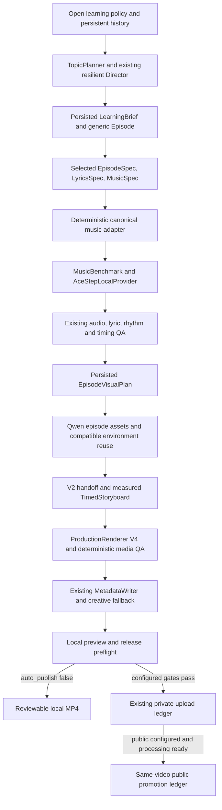

# Autonomous Short pipeline V1

`ShortProductionWorkflow` is the production application service. CLI, localhost
WebUI and future workers call `produce_next()` or `produce(episode_key)` directly.
There is no JavaScript pipeline, shell-based orchestration, alternate renderer,
new ComfyUI client, new ACE-Step adapter or new YouTube uploader.



## Operator commands

Run from the repository root with an existing operator config:

```powershell
# No confirmation: inspect persisted state, without generation or upload calls.
uv run --locked python -m tovitunes.cli --config config.yaml production produce --episode-key colors-blue-001

# Resume the existing episode; this does not create another episode.
uv run --locked python -m tovitunes.cli --config config.yaml production produce --episode-key colors-blue-001 --confirm-provider-generation

# Reserve the next creative planning run, invent a novel lesson, and produce it.
uv run --locked python -m tovitunes.cli --config config.yaml production generate-next-short --confirm-provider-generation

# Worker-oriented aliases for the same application service.
uv run --locked python -m tovitunes.cli --config config.yaml production auto-next --confirm-provider-generation
uv run --locked python -m tovitunes.cli --config config.yaml production auto-resume --episode-key colors-blue-001 --confirm-provider-generation

uv run --locked python -m tovitunes.web --config config.yaml --port 8766
```

The API equivalent is `GET /api/production/plan?episode_key=...`,
`POST /api/production/generate-next-short?confirm_provider_generation=true`, or
`POST /api/episodes/{key}/produce?confirm_provider_generation=true`.
POST without confirmation returns a plan and starts no worker/provider call.
The WebUI has **Generate Next Short** and **Resume Production** controls. The
confirmation explicitly states whether automatic publication is enabled and its
visibility. Activity shows progress; episode detail shows durable stage evidence.
Completed next-episode jobs refresh the episode list and open the produced episode.

Reports include the episode, current stage, next action, provider that would be
called, missing illustrations, publication intent, and retained preview path/ID.
Dry reports set `provider_calls=0`; execution reports do not pretend to count every
HTTP poll (`provider_calls=null`). Request ledgers provide provider identities and
submission evidence. Consumers must inspect `status`, not treat every handled CLI
invocation's zero exit code as completed production.

## Configuration and prerequisites

```yaml
automation:
  auto_publish: false
  publish_visibility: private  # or public
  require_human_review: true
  asr_model: small.en
  analysis_device: auto       # cpu or cuda also supported
  allow_model_download: false
  analysis_version: 1
```

Existing configurations remain valid; these defaults are additive. Use the
existing `music_generation`, `lesson_object_generation`, `environment_generation`
and `creative_llm` sections. Normal new generation requires ACE-Step local music
and Qwen local images. The committed example uses ACE-Step turbo, 0.6B LM, PT,
thinking, eight steps, one WAV candidate; Qwen uses the saved ComfyUI workflow.
The Kimi/GLM/Nemotron/DeepSeek and optional Ollama resilience infrastructure is reused.
Credentials stay in the existing environment/OAuth mechanism, never visual plans.

Install the existing web, video-render and analysis extras as needed. FFmpeg and
FFprobe, the approved pinned character pack, and the existing project analysis
cache are required. Run `music-benchmark analysis-doctor` before a live acceptance
test. Model downloads stay disabled unless the operator explicitly prepares the
cache with the existing `analysis-models prepare` / `prepare-timing` commands or
enables the configured download option. Analysis failures include retained QA,
alignment/transcription/rhythm evidence; music is not regenerated to hide failure.

YouTube additionally requires `publication.youtube.enabled`, the expected channel
ID and existing OAuth credentials/token. Enabling auto-publish alone grants no
rights, human approval, channel access or release eligibility.

## Durable stage model

Stages are `CREATIVE`, `MUSIC`, `AUDIO_ANALYSIS`, `VISUAL_PLAN`, `VISUAL_ASSETS`,
`STORYBOARD`, `RENDER`, `MEDIA_QA`, `METADATA`, `RELEASE`, `YOUTUBE`.
States are `NOT_STARTED`, `READY`, `RUNNING`, `PENDING_PROVIDER`, `COMPLETE`,
`NEEDS_REVIEW`, `BLOCKED`, `AMBIGUOUS`, `FAILED`.

Selected artifacts, their bytes/SHAs and dependency selections prove completed
work. Music, creative, image, environment and publication request ledgers prove
provider interactions. Append-only `production_stage_events` retain progress and
blocker evidence; an old COMPLETE event cannot replace missing artifact evidence.
`episode_music_bindings` pins the request and canonical adapter artifact for an
episode. `production_next_runs` pins the existing creative planning run before
selection, preventing a restart from reserving an additional episode.

`preview_admissions` records technical suitability separately from append-only
approval/rights decisions. `production_image_receipts` retains canonical specs,
translated workflow/seed identity, provider ID, source SHA and normalized artifact.
Environment requests gain nullable episode ownership; historical rows are not
rewritten. `workflow_process_leases` marks leases protected by the crash-released
OS lock. Only a marked lease can be reclaimed after obtaining that same exclusive
lock; unrelated/legacy leases are respected. SHA checks memoize only within one
dependency traversal, never across invocations or review decisions.

An active create-next run remains active at a pending/review/failure boundary.
Repeating next resumes it. A known episode command always resumes that episode.
The service has no interactive terminal prompts or scheduling/UI dependencies.

## Creative, music and timing contracts

Already selected valid creative artifacts are read and validated, not regenerated.
The adapter validates episode/objective/artifact links and copies each selected
lyric line exactly. Duration, BPM, mood, instrumentation, vocal direction and
section targets become canonical `MusicBrief` / `LyricCandidate` input. Section
targets describe requested music structure; they never become fabricated timings.
There is one canonical attempt, with inspected retained provider bytes and an
immutable receipt. A pending ACE-Step task resumes via `provider_resume`, never a
second `/release_task`. An ambiguous interaction stops until explicit supported
reconciliation. Changing the endpoint of an unfinished music binding blocks query
or resubmission against another service.

The existing analyzer compares transcription against exact selected lyrics and
curriculum vocabulary, preserving the historical Red policy for its original
brief. Generic timing groups measured adjacent creative sections (including
repeated sections). V2 word evidence may normalize punctuation/case while the
lyric-line text remains byte-for-byte selected text. Audio SHA, analysis/config
identity, machine QA and timing evaluation hashes remain bound to retained bytes.
Completed exact QA is reused; failed QA stops without generating another song.

## Visual plan, assets and storyboard

The additive `EpisodeVisualPlan` is produced by the existing resilient structured
Director after creative selection and audio QA. It pins all three creative artifact
IDs, episode/concept/objective, exact indexed lyric scenes, asset requirements,
Tovi actions/focus, and existing V4 environment roles. Each requirement contains:

| Field | Meaning |
| --- | --- |
| `asset_key` | Stable validated identifier chosen in persisted data |
| `kind` | `lesson_object`, `decoration`, `scene_element`, `color_swatch` |
| `semantic_label`, `display_name`, `description` | Concrete entity and generation treatment |
| `educational_role`, `educational_claims` | Bounded role and committed objective/vocabulary claims |
| `target_color` | Optional target property; Colors plans must bind the episode color |
| `grounded`, `motion` | Generic staging/motion capabilities |
| `allow_face` | Explicit creative-supported face treatment; default false |

Every asset must be used by a scene, every scene must match its selected lyric
index/text, all references must exist, and entity labels must have selected
lyric/story evidence. Safety checks are conservative structural/lexical admission,
not an assertion of artistic or semantic perfection. Colors require a deterministic
swatch from the committed palette, including rainbow. The legacy Red swatch factory
and reviewed apple/ball choices remain unchanged.

Illustrations use the existing Qwen adapter and lesson normalization helpers.
Prompts derive from the brand visual direction, requirement and educational facts.
One isolated candidate is retained per episode slot. Source and normalized assets
are separate immutable versions; white-background removal uses the established
workflow. A successfully selected candidate is reused after a crash, including
ingest-before-audit-finalization recovery. Unknown remote outcomes never resend.

The existing environment-set generator supports episode ownership and plan briefs.
A compatible approved selected shared world is reused without rewriting its
selection timestamps. Otherwise a new set is generated/retained for the episode,
not selected globally over the Red baseline. Consistency uses the shared textual
style contract; reference images are not invented for Qwen.

V2 storyboard validation binds the episode objective, exact selected lyrics,
measured alignment/beats, visual-plan ID, concrete episode asset IDs and environment
set ID. Scene coverage retains existing intro/outro and no-gap/no-overlap rules.
Renderer V4 resolves a per-plan property dictionary and actual artifact paths;
it never falls back to Red brand lesson objects for V2. Generic WAV/MP3 handoff
validates request/receipt, format, byte count/SHA, selected lyrics and machine QA.
The frozen V1 Red/Lyria/MP3 handoff retains its original provider/model/attempt,
request/blind identity, audio SHA and exact lyric validation.

## Review, rights and publication

Automatic technical admission writes no human approval or commercial clearance.
Derived structural/technical artifacts may satisfy the V2 technical gate through
their exact admission while configured content review remains separate. With
human review enabled, current human decisions are required for audio master,
generated image/environment sources, final render and metadata. Rejected or
needs-review selections cannot be silently overridden. With human review disabled,
explicit configured technical admission can satisfy V2 approval eligibility;
historical V1 gating remains unchanged. Rights still apply independently.

Qwen illustration sources are direct rights roots, alongside audio, lyrics,
environment sources and provider metadata. Existing graph closeout tools can
accept reviewed SHA-pinned rights evidence. The pipeline never manufactures it.
Private visibility uses existing private-test gates; public visibility additionally
requires every commercial-rights gate. Default auto-publish false yields a local
preview even when public release is blocked.

Automatic publication uses `PublicationService.upload_private()` and, for public
visibility, its durable `publish_public()` promotion of the same video. Successful
upload identity is reused. Remote-started/ambiguous upload or promotion requires
reconciliation; terminal upload failure does not silently retry. If YouTube is
still processing, production returns BLOCKED and a later invocation reuses the
upload before checking promotion readiness. Made-for-kids policy stays in the
existing uploader. There is no second uploader or duplicate-video path.

## Future lessons and acceptance limits

A future concept is a generated, persisted LearningBrief with immutable subject,
objective and vocabulary. It passes broad versioned policy and durable duplicate
checks; no curriculum YAML entry is required. See [open editorial memory](OPEN_EDITORIAL_MEMORY_V1.md).
Existing Colors V1 curriculum and selected older Blue artifacts remain unchanged.
The Director then selects creative facts and a typed visual plan; new
keys such as a duck, triangle, grouped apples, face or tree are persisted asset
requirements, not new Python object constants. The same adapter, generators,
storyboard, renderer, metadata writer and gated publisher consume those facts.
New provider capabilities, deterministic primitive types or genuinely different
world/character contracts remain versioned extension points, not per-video edits.

Unattended release currently depends on configured review policy, accepted source
rights, provisioned local models/services and existing OAuth. Ambiguity, failed QA,
missing resources or required human decisions intentionally stop the run. No
scheduler is implemented here; a future worker can call the service repeatedly.

Offline tests use real persistence, the existing Qwen/ACE adapters with mock HTTP,
measured-analysis fixtures, and real vertical MP4 rendering at reduced test canvas
size. Production defaults remain 1080x1920. Tests cover stage crashes, partial
assets, pending/ambiguous requests, exact lyrics/SHAs, publication reuse/promotion,
WebUI/CLI routing, review/rights separation and historical Red immutability.
They do not prove the operator's live `colors-blue-001` or GPU providers succeeded.
The operator performs that acceptance test after review and merge.
