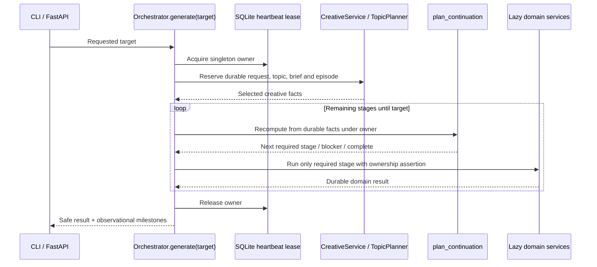
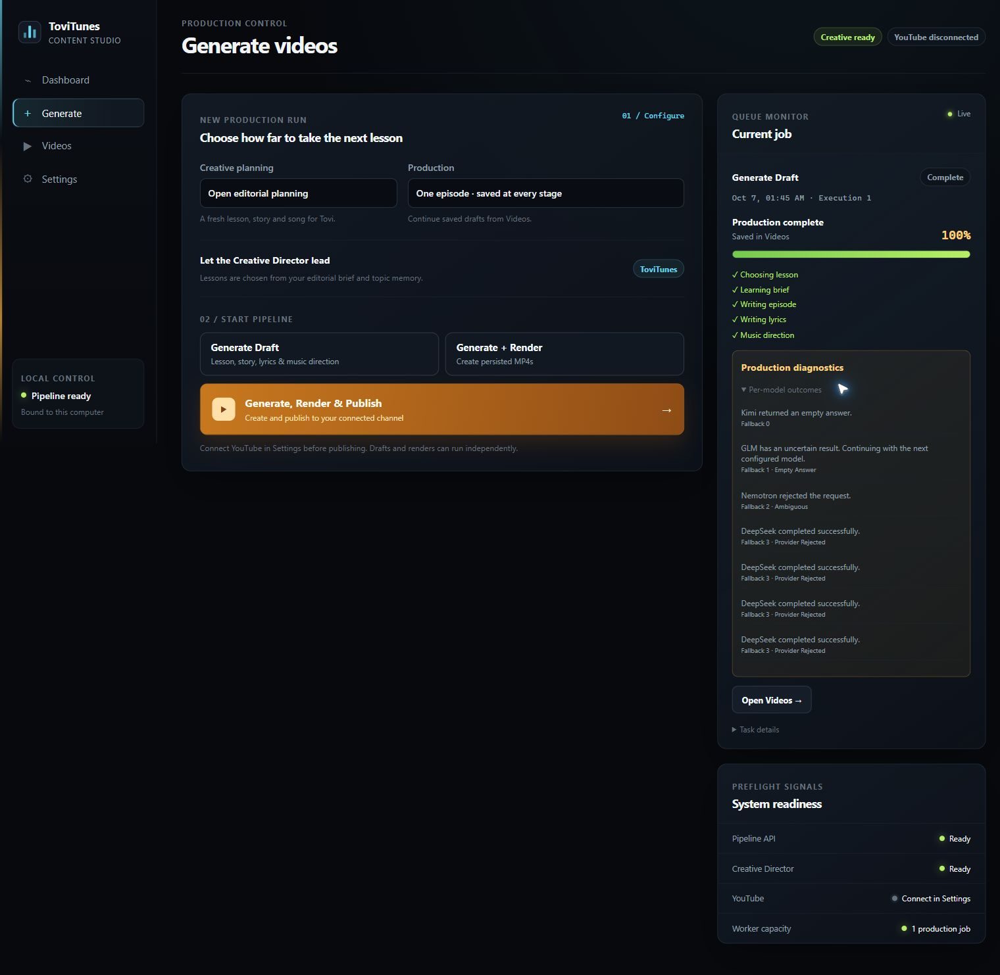
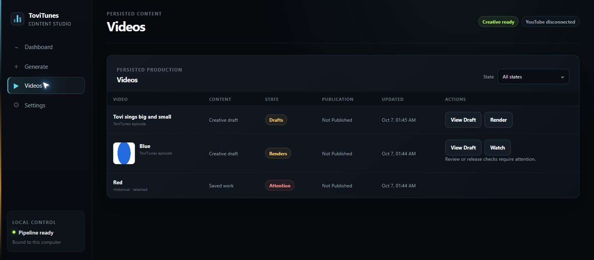
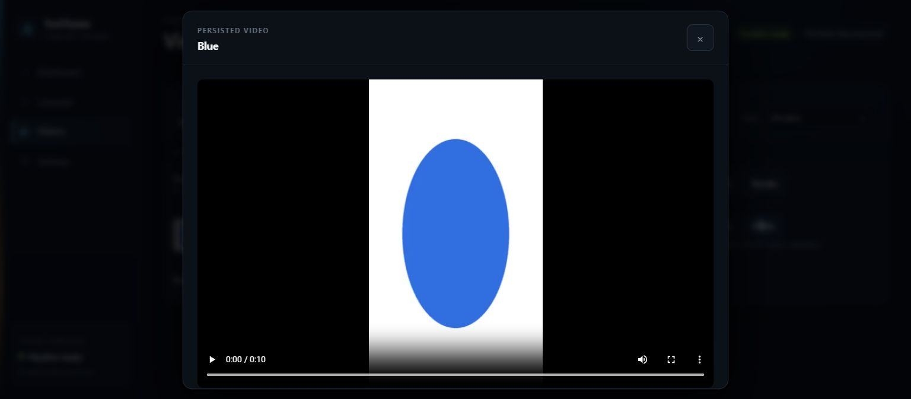

# MPT architecture migration

Canonical donor: `egegoktugbozkir35/ollama-mpt-youtube@1b82232ed794ccf611cb939ff95a1a52f3b06f52`. Baseline ToviTunes: `20b8f983b7a0a0d7156d45ba993de370468dd16a`, existing PR #41. This inventory was produced before runtime edits. Replacement, caller migration and deletion are required; no parallel runtime is retained.

| Donor component | Current equivalents | Direct copy | Domain adaptation | Delete/merge | Authority | Compatibility |
|---|---|---|---|---|---|---|
| app/config.py | config.py; stage-local config interpretation | Adapt strict typed composition | Preschool, ACE-Step, Qwen and rights settings | Stage-local construction decisions | One RuntimeConfig resolved once | Keep existing YAML keys |
| app/errors.py | creative/provider.py; ProductionStop; provider and upload exceptions | Copy central typed hierarchy and disposition | Durable request evidence and domain gate errors | MODEL_FAILURES and UI failure policy | One creative failure classifier | Exact old error decoding remains read-only |
| app/execution.py; app/state/db.py lease methods | pipeline/execution.py; per-key workflow locks | Copy heartbeat ownership and SQLite singleton methods | Database connection API | OS production locks; nested production leases | Singleton production_execution_lease | Old leases retained only for non-production tools/audit |
| app/orchestrator.py; app/cli.py build_orchestrator | ShortProductionWorkflow; CreativeWorkflow; CLI and Web effects | Adapt generate/resume, lazy factories and boundaries | CreativeService, MusicService, VisualService, RenderService, PublicationService | plan/produce/produce_next and independent web effects | Selected durable production artifacts and publication receipts | Historical V1 protected from new production |
| app/continuation.py | ShortProductionWorkflow.plan; pipeline/planner.py; Studio.library | Adapt one deterministic read-only planner | Artifact dependency hashes, QA, music task receipts | Event-derived stages; library eligibility; competing planner | Durable facts only; never job payload/status | Read historical storyboard formats |
| app/progress.py; app/run_history.py | production_stage_events; Studio counters | Copy observational typed milestones and best-effort recording | ToviTunes milestone names | Progress-derived lifecycle decisions | Diagnostics never own state | Keep old stage events and jobs readable |
| app/llm/provider.py; factory.py; resilient_generator.py; nvidia_nim_client.py | creative/provider.py; factory.py; resilience.py; nvidia.py | Copy ordered sticky chain and FailureScope, adapt durable receipts | Schemas, prompts, pins and durable ambiguity evidence | Manual creative reconciliation requirement; second failure whitelist | Immutable generation_requests | Old PR40 reconciliation rows remain immutable; no new rows required |
| app/llm/topic_generator.py; prompts.py; app/memory/* | creative/topics.py; learning.py; topic_memory.py; prompts.py | Adapt planner -> durable brief -> structured domain | Open preschool editorial memory and educational safety | Independent creative production entry point | learning_briefs; episode pins; selected outputs | Legacy curriculum only for historical reads |
| app/state/* | persistence/db.py; artifacts/store.py; migrations | Adapt transactional facts/diagnostics separation | Dependency SHA, rights and selected assets | production_next_runs as lifecycle authority | See table classification below | Append-only migration; no historical SQL edits |
| app/publishing/*; orchestrator publication lifecycle | publication/service.py; short_production._publication; library publication policy | Adapt explicit typed lifecycle and remote-ID reuse | Rights, release, expected channel and visibility promotion | Duplicate publication decision logic | publication_attempts and visibility receipts | Map old outcome strings; never retry uncertain upload |
| app/publication_queue.py | No paced scheduler in ToviTunes | No copy needed without a scheduling requirement | Immediate explicit publication targets | No parallel scheduler introduced | PublicationService remains owner | No persisted queue to migrate |
| app/mpt/adapter.py | render/production.py and workflow render reuse | Adapt trusted-result boundary | Storyboard V2, MoviePy and media QA | Renderer-owned production concurrency | Orchestrator accepts trusted render/manifest/QA | V1 renderer data stays readable |
| app/web/* | web/app.py; studio.py; jobs.py; services.py | Adapt thin routes and one-job observational worker | LocalServiceSupervisor and safe projections | Studio-only recovery orchestration; direct stage/provider routes | Same planner and generate/resume as CLI | Retained job records are UX history only |
| app/web/static/* | MPT frontend already in PR41 | Retain donor UI and add content versioning | ToviTunes controls and labels | Stale mixed-version documents | Versioned assets and no-cache HTML | Old browser eligibility is never trusted |

## Inventory coverage

Donor inventory paths reviewed: `app/__init__.py`, `app/cli.py`, `app/config.py`, `app/continuation.py`, `app/duration.py`, `app/errors.py`, `app/execution.py`, `app/llm/__init__.py`, `app/llm/audit.py`, `app/llm/factory.py`, `app/llm/nvidia_nim_client.py`, `app/llm/ollama_client.py`, `app/llm/opencode_client.py`, `app/llm/production_brief.py`, `app/llm/prompts.py`, `app/llm/provider.py`, `app/llm/resilient_generator.py`, `app/llm/topic_generator.py`, `app/logging_utils.py`, `app/memory/__init__.py`, `app/memory/similarity.py`, `app/memory/store.py`, `app/models.py`, `app/mpt/__init__.py`, `app/mpt/adapter.py`, `app/mpt/models.py`, `app/orchestrator.py`, `app/progress.py`, `app/publication_queue.py`, `app/publishing/__init__.py`, `app/publishing/models.py`, `app/run_history.py`, `app/state/__init__.py`, `app/state/db.py`, `app/state/migrations.py`, `app/web/__init__.py`, `app/web/__main__.py`, `app/web/app.py`, `app/web/jobs.py`, `app/web/models.py`, `app/web/ollama.py`, `app/web/settings.py`, `app/youtube/__init__.py`, `app/youtube/client.py`, `app/youtube/models.py`.

Associated donor test inventory: `tests/conftest.py`, `tests/test_cli.py`, `tests/test_config.py`, `tests/test_continuation.py`, `tests/test_creative_beats.py`, `tests/test_duration.py`, `tests/test_execution_ownership.py`, `tests/test_generation_fallback_audit.py`, `tests/test_lazy_dependencies.py`, `tests/test_llm_factory.py`, `tests/test_models.py`, `tests/test_mpt_adapter.py`, `tests/test_nvidia_fallback.py`, `tests/test_nvidia_nim_client.py`, `tests/test_offline.py`, `tests/test_ollama_client.py`, `tests/test_opencode_client.py`, `tests/test_orchestrator.py`, `tests/test_production_brief.py`, `tests/test_prompts.py`, `tests/test_publication_queue.py`, `tests/test_run_history.py`, `tests/test_similarity.py`, `tests/test_simple_end_to_end_guards.py`, `tests/test_state.py`, `tests/test_topic_planner.py`, `tests/test_web_api.py`, `tests/test_web_jobs.py`, `tests/test_web_main.py`, `tests/test_web_ollama.py`, `tests/test_web_retry.py`, `tests/test_web_settings.py`, `tests/test_youtube_client.py`.

Associated test strategy: pure continuation tables, lazy dependencies, singleton execution ownership, generate/resume offline integrations, provider sticky failover, trusted adapter outputs, remote-start ambiguity, and thin web requests. Existing tests that preserve superseded internals will migrate with callers.

## State classification

All existing SQL migrations remain byte-for-byte unchanged. All **48 tables** were checked against an isolated migrated database. Classification describes records, not whether a diagnostic table is physically dropped. Historical records remain available for audit.

| Table | Class | Meaning |
|---|---|---|
| `approval_decisions` | AUTHORITATIVE | Selected durable identity, gate, publication or ownership fact |
| `artifact_dependencies` | AUTHORITATIVE | Selected durable identity, gate, publication or ownership fact |
| `artifact_selections` | AUTHORITATIVE | Selected durable identity, gate, publication or ownership fact |
| `artifact_validation` | DIAGNOSTIC | Observation/history; never continuation authority |
| `artifact_versions` | PROVENANCE | Immutable source, request, configuration or analysis evidence needed for reuse |
| `brand_revisions` | PROVENANCE | Immutable source, request, configuration or analysis evidence needed for reuse |
| `character_pack_revisions` | PROVENANCE | Immutable source, request, configuration or analysis evidence needed for reuse |
| `creative_request_reconciliations` | PROVENANCE | Immutable source, request, configuration or analysis evidence needed for reuse |
| `creative_runs` | AUTHORITATIVE | Durable planning identity, selected topic and reserved episode pins; status is historical/diagnostic and never stage authority |
| `curriculum_revisions` | PROVENANCE | Immutable source, request, configuration or analysis evidence needed for reuse |
| `editorial_embeddings` | PROVENANCE | Versioned vectors used for editorial duplicate screening |
| `environment_requests` | PROVENANCE | Immutable source, request, configuration or analysis evidence needed for reuse |
| `episode_character_packs` | AUTHORITATIVE | Selected durable identity, gate, publication or ownership fact |
| `episode_music_bindings` | AUTHORITATIVE | Selected durable identity, gate, publication or ownership fact |
| `episodes` | AUTHORITATIVE | Selected durable identity, gate, publication or ownership fact |
| `execution_leases` | DIAGNOSTIC | Old production lease evidence; still used by non-production benchmark/intake resource tools, never normal production ownership |
| `generation_requests` | PROVENANCE | Immutable source, request, configuration or analysis evidence needed for reuse |
| `historical_production_episodes` | PROVENANCE | Immutable migration snapshot; protects pre-MPT identities from new effects |
| `learning_briefs` | AUTHORITATIVE | Selected durable identity, gate, publication or ownership fact |
| `learning_policy_revisions` | PROVENANCE | Immutable source, request, configuration or analysis evidence needed for reuse |
| `music_audio_analysis` | PROVENANCE | Immutable source, request, configuration or analysis evidence needed for reuse |
| `music_decisions` | AUTHORITATIVE | Selected durable identity, gate, publication or ownership fact |
| `music_lyric_decisions` | AUTHORITATIVE | Selected durable identity, gate, publication or ownership fact |
| `music_outputs` | PROVENANCE | Immutable source, request, configuration or analysis evidence needed for reuse |
| `music_policy_evaluations` | AUTHORITATIVE | Selected durable identity, gate, publication or ownership fact |
| `music_receipts` | PROVENANCE | Immutable source, request, configuration or analysis evidence needed for reuse |
| `music_requests` | PROVENANCE | Immutable source, request, configuration or analysis evidence needed for reuse |
| `music_reviews` | AUTHORITATIVE | Human music-review facts for benchmark selection/migration |
| `music_timing` | PROVENANCE | Immutable source, request, configuration or analysis evidence needed for reuse |
| `music_timing_decisions` | AUTHORITATIVE | Selected durable identity, gate, publication or ownership fact |
| `preview_admissions` | AUTHORITATIVE | Selected durable identity, gate, publication or ownership fact |
| `production_execution_lease` | AUTHORITATIVE | Selected durable identity, gate, publication or ownership fact |
| `production_image_receipts` | PROVENANCE | Immutable source, request, configuration or analysis evidence needed for reuse |
| `production_next_runs` | DIAGNOSTIC | Historical compatibility only; new production does not write this table |
| `production_requests` | AUTHORITATIVE | Durable run identity and requested stop target; contains no lifecycle/status |
| `production_runs` | DIAGNOSTIC | Observation/history; never continuation authority |
| `production_stage_events` | DIAGNOSTIC | Observation/history; never continuation authority |
| `publication_attempts` | AUTHORITATIVE | Selected durable identity, gate, publication or ownership fact |
| `publication_visibility_events` | AUTHORITATIVE | Selected durable identity, gate, publication or ownership fact |
| `rights_decisions` | AUTHORITATIVE | Selected durable identity, gate, publication or ownership fact |
| `schema_migrations` | PROVENANCE | Immutable source, request, configuration or analysis evidence needed for reuse |
| `studio_jobs` | DIAGNOSTIC | Observation/history; never continuation authority |
| `topic_rounds` | PROVENANCE | Retained planner candidate responses and bounded-attempt evidence |
| `visual_benchmark_outputs` | PROVENANCE | Immutable source, request, configuration or analysis evidence needed for reuse |
| `visual_benchmark_receipts` | PROVENANCE | Immutable source, request, configuration or analysis evidence needed for reuse |
| `visual_benchmark_requests` | PROVENANCE | Immutable source, request, configuration or analysis evidence needed for reuse |
| `visual_benchmark_reviews` | AUTHORITATIVE | Human asset-review facts for benchmark selection |
| `workflow_process_leases` | DIAGNOSTIC | Historical compatibility only; new production does not write this table |

## Compatibility boundaries

Old PR40 reconciliation decisions remain immutable audit evidence. Creative ambiguity automatically advances without resending the original request. YouTube remote-start/ambiguity remains fail-closed. Persisted nonempty remote IDs prove successful upload even if a diagnostic status is stale. Colors Red/Blue and historical V1 handoffs are protected; no live generation or production database changes are part of validation. New migrations preserve existing requests, artifacts, approvals, publication IDs and migration checksums.

## Final runtime and donor deviations

`orchestrator.py` owns effects and composition. CLI and FastAPI call `generate(target)` / `resume(key,target)`; recovery only repeats the saved user intent. `continuation.py` recomputes a deterministic plan under the singleton heartbeat lease before every stage. Music and image/environment remote-start callbacks assert that same owner, each image-loop iteration checks ownership, and lost owners cannot select returned media. Immutable returned provider receipts remain available for the next owner. Selected valid artifacts, immutable provider receipts and explicit remote IDs decide reuse. Jobs, stage events, history, UI counters and timing cannot decide production state. Progress/reporting/history errors are best-effort observations. Lease loss before a remote-start callback leaves the request prepared for the next legitimate owner. Invalid saved job payloads are skipped so diagnostic corruption cannot prevent the Web application from opening.

The donor heartbeat ownership implementation and SQLite lease methods were ported directly, adapting imports and connection helpers. Donor strict frozen configuration, central typed errors (including YouTube/channel errors), FailureScope, ordered sticky fallback, lazy factories, typed progress, best-effort history, renderer result acceptance and publication lifecycle are adapted to the existing durable ToviTunes domain. No old production lock, planner or workflow is called through an adapter.

Remaining differences have domain reasons:

- CreativeService retains preschool schemas, safety, cast pins and immutable LearningBrief/topic memory. Its historical curriculum reads preserve saved Colors identity.
- MusicService retains ACE-Step submission/retrieval, the original task ID, analysis and music QA. An uncertain interaction with a known task retrieves that task; it never submits a replacement song.
- VisualService retains Qwen/ComfyUI asset and environment receipts. Their remote uncertainty remains blocked.
- RenderService retains Storyboard V2, MoviePy/FFmpeg and Tovi composition. The renderer registers result bytes and returns a trusted path/manifest/QA; the orchestrator validates identity and atomically selects final media plus QA. Intermediate artifacts are reusable storage facts. Render and its associated QA are one atomic acceptance boundary.
- PublicationService retains rights/review gates, private upload followed by same-video public promotion, expected channel checks and exactly-once uncertainty. The typed lifecycle maps existing receipt strings without rewriting historical rows. A nonempty remote ID is success even if an outcome label is stale. A conclusively failed preparation is retryable; uncertainty after remote start cannot be retried automatically.
- LocalServiceSupervisor remains infrastructure for installed ACE-Step/ComfyUI. Production uses provider contracts and never launches processes through the orchestrator.
- ArtifactStore remains a repository for bytes, SHA/dependency eligibility, rights and selections. Historical V1 handoff tools are migration/import utilities; new production never constructs V1 storyboard output.
- No publication queue was added: there is no paced scheduling requirement or historical queue state to migrate.

## Generate and resume sequences



```mermaid
sequenceDiagram
  participant UI as CLI / FastAPI / recovered job
  participant O as Orchestrator.resume(reference,target)
  participant L as SQLite heartbeat lease
  participant P as plan_continuation
  participant D as Domain service
  participant R as Renderer
  UI->>O: Saved identity and requested target
  O->>L: Acquire owner, reject cross-process overlap
  opt Pre-episode run reference
    O->>D: Load exact run, continue its durable creative receipts
    D-->>O: Reserved episode identity
  end
  O->>P: Recompute (ignore stale browser/jobs/events)
  P-->>O: Reusable stages and next stage
  alt Complete or protected historical data
    O-->>UI: Retained result, no provider creation
  else Required render
    O->>R: Render retained storyboard under owner
    R-->>O: Trusted media path + manifest + QA
    O->>O: Verify root, bytes/SHA, identity and QA; atomically select
  else Required provider/publication stage
    O->>D: Reuse receipt/task or start one fenced interaction
    D-->>O: Persisted result / explicit ambiguity
  end
  O->>P: Recompute before next effect
  O->>L: Release owner
```

## Compatibility and deletion

Migration `0024_mpt_architecture.sql` adds the singleton lease, request identities and diagnostic history. It snapshots existing episode identities as read-only historical production and imports bound old `production_next_runs` identities once into `production_requests`. Generate always reserves a new creative run and request without reading historical production requests. Resume explicitly identifies an episode or pre-episode run through `ProductionReference`; it never discovers another pending run. Studio recovery uses only the failed job's retained episode or run identity. Unbound historical runs remain audit evidence. New runtime never reads/writes the old lifecycle table. Migrations 0001–0023 remain byte-identical. Old requests, reconciliation evidence, publication IDs, selected artifacts and rights rows are retained. A pre-0021 upgrade fixture and pre-editorial Red/Blue fixture verify data/checksum preservation. Tests and screenshots use isolated data roots; live saved Red/Blue production is not regenerated.

Deleted source modules: `pipeline/short_production.py`, `pipeline/planner.py`, `pipeline/execution.py`, `creative/workflow.py`. Their callers now use the canonical application or specialized domain services. Removed the old curriculum subject-pool generation/reservation branch, creative abandon writer/CLI command, event-derived editorial status, duplicate library eligibility, independent Web metadata/render/upload effects, renderer-owned production lease, nested publication/creative leases, Studio fallback/reconciliation workflow and the second provider failure whitelist.

Deleted superseded guides: ARCHITECTURE_PROPOSAL, AUTONOMOUS_SHORT_PIPELINE_V1, CONTINUATION, CREATIVE_FALLBACK, STUDIO_V1 and WEBUI_YOUTUBE_V1. Current runtime is described here and domain-only guides retain unique contracts.

Against the PR baseline, `git diff --no-renames --numstat -- src` records **3,440 source lines inserted, 3,560 removed, net −120**. The four superseded module paths contained 2,409 lines; their unique domain algorithms were moved into the specialized services, while their orchestration, locks and planner implementations were removed. Across source, tests and guides the refactor also deletes obsolete contracts and documentation. File splitting adds small domain modules; module count is not used as a substitute for measuring competing runtime responsibilities.

Architecture counts after replacement: **2 normal production-effect entry points**, **1 continuation decision location**, **1 creative failure classifier**, **1 publication state-machine owner**, **1 production concurrency owner**. Non-production benchmark/intake tools retain their own local resource leases; they are not production entry points. Historical audit tables stay physically readable and do not own new production.

## Validation and screenshots

Local validation results are recorded below. The linked PR checks run the complete offline suite on Windows for the final source; the PR description records the final run URL and result.

| Check | Result |
|---|---|
| Ruff | Passed |
| mypy | Passed, 111 source files |
| JavaScript syntax | Passed (`node --check`) |
| Character-pack lock | Passed, 48 immutable artifacts |
| Historical migration Git blobs | 0001–0023 byte-identical to baseline |
| Creative/domain fallback regressions | 132 passed |
| Publication/Web regressions | 38 passed |
| Observational jobs/progress regressions | 5 passed |
| Complete local offline suite | **884 passed**, 635.00 s, runtime commit `56aaad7` (the previous complete run also passed 885 before deleting one obsolete private-method test) |
| Final singleton-fencing regressions | **2 passed**; losing ownership after music preflight prevents submission, and losing it after an image response preserves the receipt without selecting or submitting further assets |
| Domain fencing regressions | **21 music + 6 environment passed** |
| Windows CI | [PR #41 checks](https://github.com/egegoktugbozkir35/ToviTunes/pull/41/checks): full offline suite, Ruff, mypy and character-pack validation for the final source, including both added ownership-loss tests |

 Offline coverage includes public DRAFT/RENDER/PUBLISH boundaries, poisoned diagnostics, lazy provider construction, real FFmpeg media/QA, restart in separate processes at every authoritative boundary, immutable creative ambiguity with automatic forward-only fallback, renderer acceptance, channel mismatch, retained remote ID reuse and uncertain YouTube no-resend behavior. Legacy tests tied to deleted private workflow methods were replaced with application-boundary tests; domain contract/release/rights/byte-integrity tests remain.

Screenshots use an isolated offline Studio database and mocked provider transports, with a real rendered MP4. The Red/Blue labels in these screenshots are test fixtures; saved production episodes were never opened for effects. They show:

- [Completed draft](screenshots/mpt-studio-draft.jpg), stopped before all media providers.
- [Automatic creative fallback](screenshots/mpt-automatic-fallback.jpg), retaining GLM ambiguity and proceeding to the next configured model without reconciliation.
- [Durable library](screenshots/mpt-durable-library.jpg), projected from the same continuation planner.
- [Retained real MP4](screenshots/mpt-retained-render.jpg), opened through the protected artifact preview route.





The local suite and CI use mocked provider transports and isolated databases. Rendering/QA use real FFmpeg; ASR/beat inference is replaced with deterministic offline fixtures. These checks verify application contracts and restart/reuse, not live provider quality. One third-party Starlette/httpx deprecation warning remains; it does not affect the results. No CUDA/model download, live provider request, production Red/Blue change, OAuth credential change or YouTube publication was part of validation.
