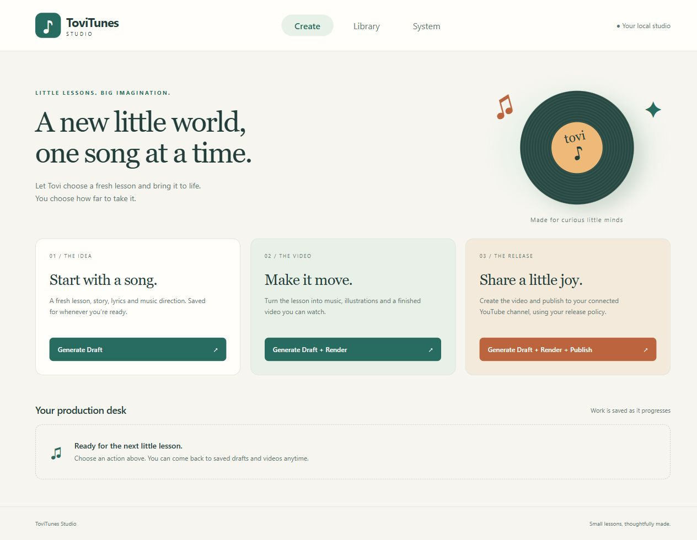
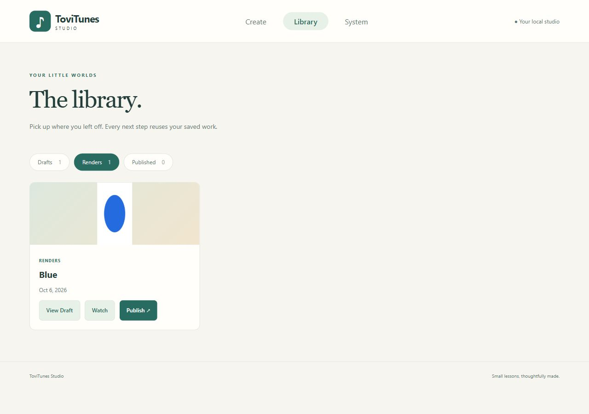
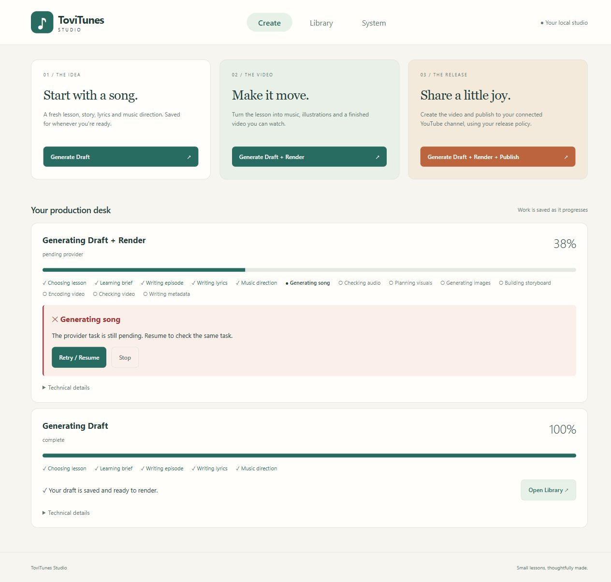
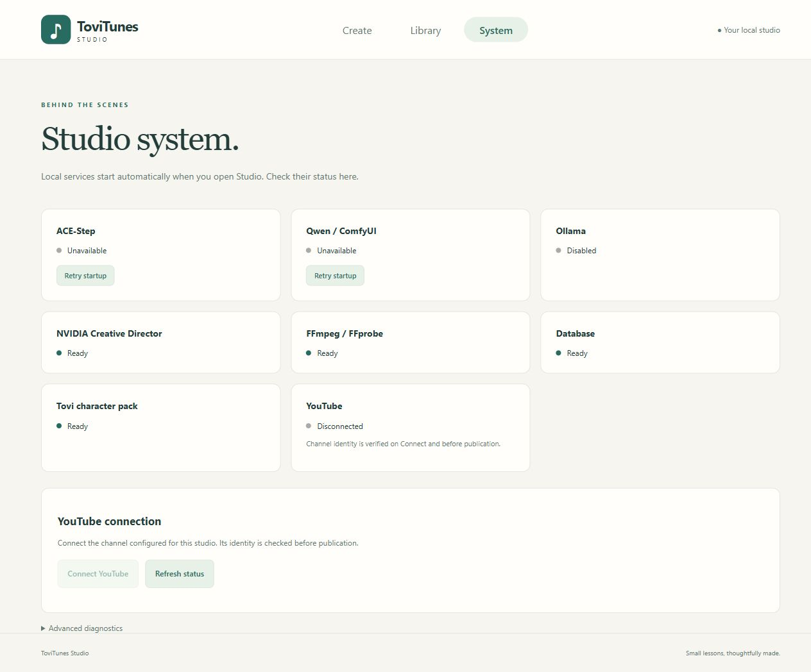

# ToviTunes Studio V1

Double-click `start-ui.bat`, choose **Draft**, **Draft + Render**, or **Draft + Render +
Publish**, and watch the production desk. Use **Library** to render an existing draft or
publish a retained video. **System** contains technical health and local startup recovery.
No run/request/artifact identifiers or provider choices are required in the creative flow.
After a task exists, Create compacts the introduction and keeps the latest running, paused
or completed task as the primary production card.

## Setup once, operate in the browser

Use your existing `config.yaml` and production data. With no personal config the launcher
falls back to `config.example.yaml` and opens an empty library. Install provider environments,
model files, FFmpeg/FFprobe, and the normal Tovi pack once; the launcher starts installed
services, rather than installing/downloading large model stacks. Configure your NVIDIA
environment credential and YouTube OAuth client/channel once. **System → Connect YouTube**
performs the normal browser authorization and identity check.

The default UI address stays `http://127.0.0.1:8766`. Repeated double-clicks reopen the healthy
existing Studio. The browser can close while a job runs; reopening it reads the same job.
After the server restarts, interrupted tasks appear with **Retry / Resume**. Resume uses
the same task identity and target, increments the execution count and rereads durable evidence.
An interrupted YouTube operation is checked against its ledger before any further upload.

## One pipeline, three boundaries

`ProductionTarget` and `stages_for()` describe the stopping target of the existing
`ShortProductionWorkflow`. Both `produce_next(target=...)` and `produce(key, target=...)`
use the same implementation.

| Target | Final stage | What is retained |
| --- | --- | --- |
| Draft | CREATIVE | Open-editorial topic/history decisions, immutable LearningBrief/Episode, selected EpisodeSpec, LyricsSpec, MusicSpec |
| Render | METADATA | Draft plus ACE-Step audio, analysis/QA, EpisodeVisualPlan, Qwen assets/environment, Storyboard V2, Renderer V4 MP4/media QA, metadata |
| Publish | YOUTUBE | Render plus existing release preflight, private upload and gated public promotion when configured |

Draft returns before music, image, render or YouTube work. Render returns before RELEASE and
YOUTUBE. Publish reuses a validated final render and QA, skipping upstream generation and
encoding, and reuses valid metadata. Selected creative artifacts are validated/reused on
continuation. The workflow keeps the original provider request and receipt safety checks.

The Studio sends `operator_publish=True` only from an explicit product action or its persisted
recovery. This authorizes publication without `automation.auto_publish=True`. It does **not**
override release, rights, review, enabled-channel, identity or visibility policy. Legacy
CLI/API calls keep the previous default and unattended publication semantics.

Successful upload receipts are reused even if later metadata changes. Ambiguous upload or
promotion history remains fail-closed. Historical V1 production (including Colors–Red) returns
without changing selections or history. V2 uploads also freeze creative/media/metadata selections;
an explicit later Publish can promote the retained private upload under current release gates.
New uploads record their verified configured channel; a known channel mismatch blocks reuse
as a new publication target. Old receipts keep their historical fields unchanged and are never
used to authorize a duplicate upload.

## Durable library

`web.studio.library()` is one read-only projection. It validates selected artifact hashes,
dependencies and creative contracts; checks final render/media QA identity and SHA; and reads
publication history. It never calls a generator or selects artifacts.

* **Drafts:** valid selected creative trio and no valid completed render. **View Draft / Render**.
* **Renders:** valid retained MP4/manifest/media QA, not successfully published at configured
  visibility. Publication review/rights holds do not hide a valid local preview. **Watch / Publish**.
* **Published:** successful publication at configured visibility, plus immutable historical
  uploads. Publication state, visibility and safe video link; no duplicate-upload action.
* Incomplete creative evidence appears as **Needs attention** beside drafts. An uncertain
  YouTube receipt or known different channel disables Publish and shows one blocker.

Missing metadata is handled by the normal Publish continuation. Published Red and existing
Blue selections use the same durable projection; no lesson/color special cases are introduced.

## Progress and recovery

Jobs contain target, current stage/substage, completed/total milestones, whole-task percent,
timestamps, execution, safe blocker/result and available recovery. Migration 0022 stores jobs
in SQLite; production artifacts/events and provider ledgers remain authoritative.

Creative progress includes topic, brief reservation, episode, lyrics and music direction.
Render adds music, analysis, visual plan/assets, storyboard, encoding, media QA and metadata.
Publish adds release/YouTube. Completed real milestones contribute equal weights. Percent is
monotonic within an execution, stays below 100 until successful completion and does not guess
remote completion percentages. Visual item/environment messages describe actual work.

Failures appear beside the stage with an available recovery action. Technical details are
collapsed initially and remain open when deliberately expanded. **Stop** dismisses a paused
task without discarding artifacts or automatically retrying it; active external requests must
settle before stopping, so their durable identity is preserved.

For PR #40 creative ambiguity with `abandon_remote_result`, **Continue with next model**:

1. Records immutable `CreativeReconciliations.abandon()` with `human:webui-operator` and a
   rationale explaining inaccessible remote output and same-task continuation.
2. Makes zero provider calls during reconciliation.
3. Resumes the same job/episode target using the configured generic fallback chain.

A timed-out ACE-Step request with a retained provider task identity exposes
**Resume retained ACE-Step task**. This explicitly invokes the existing provider-retrieval
path for that task and then resumes the same job/target; it never submits another song.
Missing task identity stays fail-closed. Pending retrieval keeps the same recovery action.

Conclusive subsequent model failures still fall back automatically. A new ambiguity pauses
again; receipt-bearing ambiguity is not silently abandoned. YouTube ambiguity never receives
the creative abandonment action. Studio results allowlist safe identifiers/categories and
translate error messages; request validation and exceptions do not echo submitted secrets or
remote response bodies. Existing localhost/origin guards and historical endpoints are retained.

## One-click local services

The small BAT calls `python -m tovitunes.web.launcher`. Python claims the UI port before
starting services, resolves configuration, creates the app, starts bounded readiness workers,
and opens the browser when the UI health endpoint is ready. Provider startup failure does not
prevent the browser or Studio from opening. System exposes **Retry startup** for local services.

The supervisor checks ACE-Step `/health`, ComfyUI `/system_stats`, and configured Ollama
`/api/tags`. Healthy services are reused and never owned/killed. Missing services use optional
argument-array `local_services` configuration, then safe discovery:

* ACE-Step: `TOVITUNES_ACE_STEP_HOME`, user Desktop or home ACE-Step-1.5 checkout;
  the official `uv run --no-sync acestep-api --host 127.0.0.1 --port ...` entry point.
* ComfyUI: `TOVITUNES_COMFYUI_HOME`, user Desktop/Documents/home installs, standard
  LocalAppData Desktop layouts and the Desktop configured base path. An installed virtualenv
  or portable Python starts `main.py` bound to the configured localhost port.
* Ollama: installed executable, only if creative fallback or topic embeddings require it.
  NVIDIA is remote and is never launched or polled for health.

Discovery cannot support every custom installation. Explicit executable/cwd configuration is
the stable override (examples in `config.example.yaml`). Paths are config-relative or
user-relative, not tied to a particular username. Shell executables/scripts and credential
arguments are rejected; processes use `shell=False`, filtered environments and hidden Windows
launch flags. Timestamped service logs live under `data_root/logs/services`. Only tracked child
processes are terminated at launcher exit; Windows cleanup includes their process tree.

Health probes are local, bounded and cached. YouTube connection status uses saved verification
results; Connect and actual publication verify channel identity, avoiding repeated remote
requests during dashboard polling. FFmpeg/FFprobe, database, NVIDIA configuration and Tovi pack
are reported without remote generation calls.

## API and implementation map

| Product endpoint | Operation |
| --- | --- |
| POST `/api/studio/create` | JSON `target: draft|render|publish` |
| POST `/api/studio/episodes/{key}/continue` | JSON `target: render|publish` |
| GET `/api/studio/library` | Read-only durable classification/previews |
| GET `/api/jobs/{id}` | Structured persisted progress/result |
| POST `/api/studio/jobs/{id}/recover` | Safe action inferred from retained blocker; no UUID entry |
| POST `/api/studio/jobs/{id}/stop` | Dismiss paused task |
| POST `/api/system/services/{name}/retry` | Retry configured local startup; blocked during production |

`pipeline/targets.py` defines targets/milestones; `short_production.py` owns orchestration;
`creative/workflow.py` and `render/episode_assets.py` report actual substeps; `web/jobs.py`
persists progress; `web/studio.py` holds the product API/library/recovery; `web/supervisor.py`
and `web/launcher.py` own the local stack. Static HTML/CSS/JS supplies the three-page operator
surface without a frontend build system. Publication service records future channel identity.

MPT donor study: its typed milestone progress, single active job card, mode-specific labels
and orchestrator resume boundary informed Studio's simplicity. ToviTunes continues to use its
own production services, schemas, artifact graph and provider safety ledgers.

## Offline validation

`tests/test_studio_v1.py` adds target boundary/reuse, actual mock-provider MP4, durable library,
progress/restart, WebUI reconciliation/fallback, safe failures/concurrency, explicit publication
with actual release/rights gates, launcher ownership/start/failure and browser-opening tests.
The existing production, creative reconciliation, publication, renderer and historical API
suites remain part of validation. No live provider or YouTube generation calls are used.

Run `uv lock --check`, `uv run --locked pytest -q`, `uv run --locked ruff check .`,
`uv run --locked mypy src`, `node --check src/tovitunes/web/static/app.js`, `git diff --check`
and the established character-pack `validate-lock` command. Screenshots use isolated local
fixtures; they never touch the operator's existing data or published output.

## Screenshots

Captured in an isolated local browser session with offline provider fixtures. The operator
clicked Generate Draft, View Draft, Render and Watch; no live provider or YouTube call occurred.
Desktop (1280px) and narrow (360px) layouts were inspected without adding browser test tooling.

